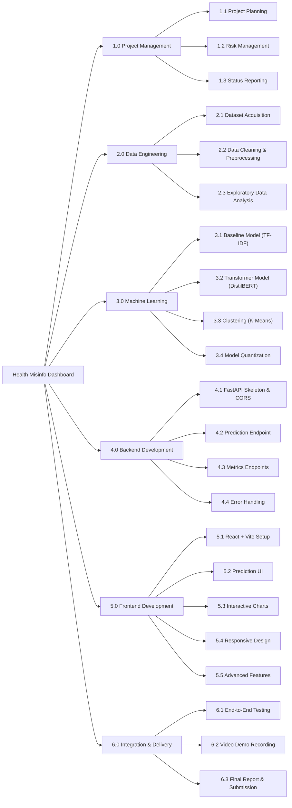

# Project Management Plan - Phase 2

## 5. Scope Management

### 5.1 Project Scope Statement

The project scope defines the boundaries of the Health Misinformation Fact-Checking Dashboard, detailing what will be delivered and what is explicitly excluded.

**In Scope:**
- **Data Engineering:** Acquisition, cleaning, and preprocessing of the PUBHEALTH and Constraint-English (Fake) datasets (handling emojis, Unicode homoglyphs, and leetspeak).
- **Machine Learning Pipeline:** 
  - Development of a baseline TF-IDF + Logistic Regression model.
  - Fine-tuning of a DistilBERT transformer model for primary classification.
  - K-Means clustering for exploratory data analysis.
  - Dynamic INT8 quantization of the DistilBERT model to fit within strict memory constraints (<200MB).
- **Backend Development:** A robust FastAPI-based RESTful backend featuring cross-origin resource sharing (CORS), error handling, and multiple HTTP methods (POST, GET). Endpoints will handle model inference (`/predict`), metrics (`/metrics`), and dataset statistics (`/dataset`).
- **Frontend Development:** A responsive React.js web dashboard built with Vite and Tailwind CSS. It will feature:
  - An input form for health claims with live validation.
  - A dynamic prediction result card and confidence gauge using Framer Motion.
  - Five distinct interactive charts (Bar, Radar, Area, Confusion Matrix, and Donut) using Recharts.
- **Advanced Features:** Capability for CSV export of prediction history, batch analysis via file upload, side-by-side model comparison, and dark mode toggling.

**Out of Scope:**
- **User Authentication:** No user login, registration, or session management system will be implemented.
- **Real-time Social Media Scraping:** The system will not perform live web scraping or Twitter/X API polling to ensure the application remains stable for demonstration.
- **Mobile Native App:** A dedicated native mobile application (iOS/Android) will not be built, though the web interface will be fully responsive for mobile browsers.
- **Microservices Architecture:** The backend will be constructed as a monolith, avoiding the complexity of distributed microservices.

### 5.2 Work Breakdown Structure (WBS)

### 5.3 WBS Dictionary

| WBS ID | Work Package | Description | Deliverable | Estimated Effort | Dependencies |
|--------|-------------|-------------|-------------|-----------------|--------------|
| 1.1 | Project Planning | Define scope, WBS, schedule, and management plans | Project Management Plan | 5.0h | None |
| 1.2 | Risk Management | Identify risks, assess impact, and define mitigations | Risk Register & Plan | 1.5h | 1.1 |
| 1.3 | Status Reporting | Document weekly meetings and project progress | Meeting Minutes | 1.0h | 1.1 |
| 2.1 | Dataset Acquisition | Download PUBHEALTH TSV and basic constraint datasets | Raw data files | 1.0h | None |
| 2.2 | Data Cleaning | Preprocess text (remove emojis, leetspeak, normalize) | Preprocessing script | 2.0h | 2.1 |
| 2.3 | Exploratory Data Analysis | Analyze data distributions and perform clustering | EDA notebook | 2.0h | 2.2 |
| 3.1 | Baseline Model | Train and evaluate TF-IDF + Logistic Regression model | `tfidf_logreg.joblib` | 2.0h | 2.2 |
| 3.2 | Transformer Model | Fine-tune DistilBERT on PUBHEALTH dataset | Fine-tuned model (`.pt`) | 4.0h | 2.2 |
| 3.3 | Clustering | Apply K-Means clustering on TF-IDF embeddings | `kmeans_clusters.joblib` | 1.0h | 2.3, 3.1 |
| 3.4 | Model Quantization | Apply dynamic INT8 quantization to DistilBERT | `distilbert_quantized.pt` | 1.0h | 3.2 |
| 4.1 | FastAPI Skeleton | Setup FastAPI project structure and CORS middleware | Backend skeleton code | 1.0h | None |
| 4.2 | Prediction Endpoint | Implement `POST /predict` with model inference | API endpoint | 2.0h | 3.4, 4.1 |
| 4.3 | Metrics Endpoints | Implement `GET /metrics` and `GET /dataset` endpoints | API endpoints | 1.0h | 4.1 |
| 4.4 | Error Handling | Add input validation and HTTP error responses | Robust API routes | 1.0h | 4.2, 4.3 |
| 5.1 | React + Vite Setup | Initialize React project with Tailwind CSS and Vite | Frontend skeleton code | 1.0h | None |
| 5.2 | Prediction UI | Create text input form, result card, and gauge | UI components | 2.5h | 5.1 |
| 5.3 | Interactive Charts | Build Bar, Radar, Area, Matrix, and Donut charts | Chart components | 3.0h | 5.1 |
| 5.4 | Responsive Design | Implement Tailwind breakpoints and dark mode | Responsive UI | 1.0h | 5.2, 5.3 |
| 5.5 | Advanced Features | Add CSV export, batch analysis, and model comparison | Advanced functionality | 1.5h | 5.2, 5.3 |
| 6.1 | End-to-End Testing | Test integrated frontend and backend with edge cases | Test passing results | 1.5h | 4.2, 5.2 |
| 6.2 | Video Demo Recording | Record 7-minute demonstration of all features | Video file (.mp4) | 1.5h | 6.1 |
| 6.3 | Final Report | Assemble and review final submission document | Final PDF/Docx | 1.0h | All |
