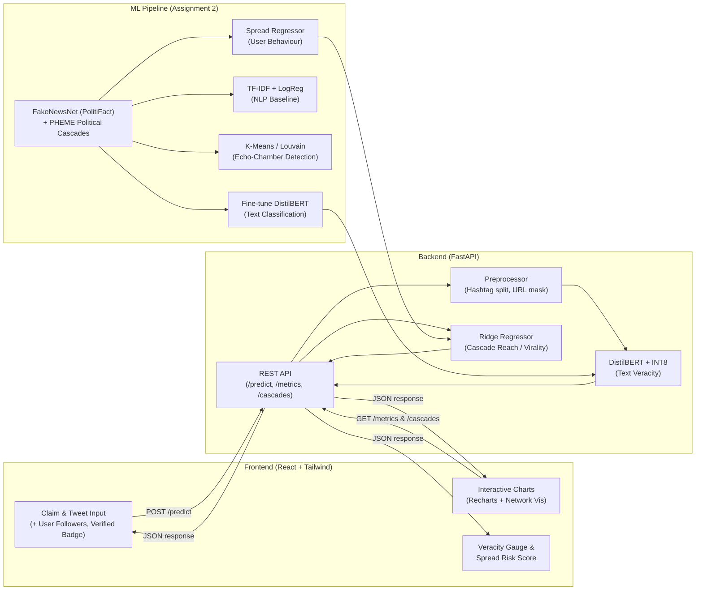

# 🗳️ Implementation Plan: Political & Breaking News Misinformation Detection Dashboard

## Goal Description

Build an **Automated Political & Breaking News Misinformation Detection Dashboard** that uses a fine-tuned Transformer model (DistilBERT) on PHEME and FakeNewsNet (PolitiFact) datasets to classify political claims and breaking news as **Factual (Verified) or Misinformation (Rumor)** with confidence scores and spread risk predictions. The project spans three university assignments (COS30048/COS30049) worth 100% of the unit grade, targeting a **High Distinction (HD)** across all three.

### Outcome
A full-stack web application (React + FastAPI) where users input political claims or breaking news tweets and receive binary veracity classifications plus cascade/virality predictions — proving the Transformer's attention mechanism understands context and user behavior patterns, not just keywords.

### Constraints
- Must use **React.js** (frontend) and **FastAPI** (backend) per assignment spec
- Must use **at least 2 ML method types** for Assignment 2 (+ extras for HD)
- Must use **additional datasets** beyond the basic provided one for HD
- Must include **≥3 chart types with interactive features** for Assignment 3 HD
- Must include **≥2 HTTP methods** and **≥3 advanced functionalities**
- Model must run within **free-tier cloud RAM** (~512MB–1GB)
- No generative AI for content generation (but allowed for learning/debugging)
- Video demo ≤7 minutes showing all features on desktop, tablet, mobile

### Non-Goals
- No real-time Twitter/X scraping in production (too brittle for grading demo)
- No microservice architecture (monolith is sufficient and more reliable)
- No user authentication system (not required by spec)
- No mobile native app

### Acceptance Criteria
1. Model achieves **Macro F1 ≥ 0.75** on combined PHEME + FakeNewsNet test set
2. Dashboard correctly differentiates misinformation from factual text using similar vocabulary (the "Control Test")
3. All 3 assignment rubric criteria are satisfied at HD level
4. Application runs locally with a single `npm run dev` + `uvicorn` command
5. Quantized model fits in **< 200MB** RAM

---

## User Review Required

> [!IMPORTANT]
> **Assignment 2 ML Methods**: The rubric requires ≥2 ML method types. This plan proposes:
> 1. **Classification** — DistilBERT Transformer (primary binary classifier: factual/misinformation)
> 2. **Classification** — TF-IDF + Logistic Regression (baseline comparison)
> 3. **Clustering** — K-Means / Community Detection on PHEME user graphs (echo chamber analysis)
> 4. **Regression** — Ridge Regressor for cascade spread prediction (predicts reach from user metadata)
>
> This provides classification (2 methods with strong baseline justification), clustering (different type), and regression (different type) for comprehensive HD coverage.

> [!NOTE]
> **Dataset Selection**: The plan uses PHEME Political Cascades (Ferguson, Putney Bridge) and FakeNewsNet PolitiFact as the primary datasets. The basic dataset from `1misinfo` folder is **NOT used** as it's not relevant to the political/breaking news domain.

> [!IMPORTANT]
> **Assignment 1 is a document, not code.** This plan focuses on Assignments 2 and 3 (the code deliverables). Assignment 1's project management plan, WBS, Gantt chart, and UI prototypes should be handled separately. Since the team size is 1, project management overhead is minimal, but the documentation is still required.

---

## Environment & Logistics Decisions (Resolved)
- **Team Size**: Solo developer (1 person). 
- **Deployment Target**: Local demo running on MacBook Air M3.
- **Model Training**: Locally on MacBook Air M3 16GB (using PyTorch MPS). Google Colab is a backup only if disk space becomes an issue.
- **Primary Datasets**: 
  - **PHEME Political Events** (Ferguson, Ottawa Shooting, Putin Missing, Charlie Hebdo) — ~4k threads, ~40k tweets with cascade structures
  - **FakeNewsNet PolitiFact** — Fact-checked political news articles with social diffusion data
  - **Domain Overlap**: Direct match on Ferguson (civil unrest/political), Putin Missing (geopolitics), Ottawa Shooting (government/security) — creates unified political misinformation domain

---

## System Architecture



---

## Proposed Changes

### Phase 1: Project Setup & Data Pipeline
**Effort**: ~3 hours | **Assignment**: 2

> Sets up the monorepo, downloads datasets, and builds the preprocessing pipeline.

---

#### [NEW] `/backend/` — FastAPI Project Skeleton

```
backend/
├── app/
│   ├── __init__.py
│   ├── main.py              # FastAPI app, CORS, lifespan (model loading)
│   ├── routes/
│   │   ├── __init__.py
│   │   ├── predict.py        # POST /predict
│   │   ├── metrics.py        # GET /metrics
│   │   └── cascades.py       # GET /cascades/stats, GET /cascades/network
│   ├── models/
│   │   ├── __init__.py
│   │   └── schemas.py        # Pydantic request/response models
│   ├── services/
│   │   ├── __init__.py
│   │   ├── preprocessor.py   # Hashtag splitting, @mention handling, URL masking
│   │   ├── inference.py      # Model loading + prediction logic
│   │   └── cascade.py        # Spread prediction logic
│   └── config.py             # Settings (model path, max tokens, etc.)
├── data/
│   ├── fakenewsnet_politifact/     # FakeNewsNet PolitiFact subset
│   ├── pheme_political/            # PHEME Ferguson, Putney Bridge cascades
│   │   └── pheme_pyg_dataset.pt    # PyTorch Geometric graph data
│   └── cascade_samples.db          # Pre-analyzed cascades for demo fallback
├── models/                         # Exported model artifacts
│   ├── distilbert_quantized.pt
│   ├── tfidf_logreg.joblib
│   ├── community_clusters.joblib
│   └── spread_regressor.joblib
├── notebooks/
│   ├── 01_data_exploration.ipynb
│   ├── 02_preprocessing.ipynb
│   ├── 03_baseline_tfidf.ipynb
│   ├── 04_distilbert_finetune.ipynb
│   ├── 05_quantization.ipynb
│   ├── 06_community_detection.ipynb
│   └── 07_spread_prediction.ipynb
├── requirements.txt
└── README.md
```

#### [NEW] `/frontend/` — React + Vite Project Skeleton

```
frontend/
├── public/
├── src/
│   ├── components/
│   │   ├── Layout/
│   │   │   ├── Header.jsx
│   │   │   ├── Sidebar.jsx
│   │   │   └── Footer.jsx
│   │   ├── Predict/
│   │   │   ├── InputForm.jsx          # Text input + user metadata
│   │   │   ├── ResultCard.jsx         # Red/Green classification card
│   │   │   ├── ConfidenceGauge.jsx    # Animated SVG gauge (Framer Motion)
│   │   │   └── SpreadRiskBadge.jsx    # High/Moderate/Low spread risk
│   │   ├── Charts/
│   │   │   ├── CategoryBarChart.jsx   # Bar chart: claim categories
│   │   │   ├── MetricsRadarChart.jsx  # Radar: Accuracy/Precision/Recall/F1
│   │   │   ├── ConfusionMatrix.jsx    # Tailwind CSS Grid heatmap
│   │   │   ├── CascadeBubbleChart.jsx # Scatter: spread velocity vs. rumor probability
│   │   │   ├── TimelineAreaChart.jsx  # Area chart with Brush zoom (PolitiFact timeline)
│   │   │   └── NetworkGraph.jsx       # Force-directed graph: PHEME user interactions
│   │   └── common/
│   │       ├── ErrorBoundary.jsx
│   │       ├── LoadingSpinner.jsx
│   │       └── StatusBadge.jsx        # 🟢 Live / 🟡 Demo Mode
│   ├── hooks/
│   │   ├── usePredict.js              # API call hook for /predict
│   │   ├── useMetrics.js              # API call hook for /metrics
│   │   └── useCascades.js             # API call hook for /cascades
│   ├── pages/
│   │   ├── Dashboard.jsx              # Main prediction page
│   │   ├── Analytics.jsx              # Charts + metrics page
│   │   ├── Network.jsx                # Network visualization page
│   │   └── About.jsx                  # Project description
│   ├── services/
│   │   └── api.js                     # Axios instance + error interceptors
│   ├── App.jsx
│   ├── main.jsx
│   └── index.css                      # Tailwind directives
├── tailwind.config.js
├── vite.config.js
├── package.json
└── README.md
```

#### [NEW] `backend/app/services/preprocessor.py`

Key preprocessing logic to handle political social media text:

```python
import re
import unicodedata

def preprocess_political_text(text: str, max_length: int = 512) -> str:
    """
    Clean and normalize political claim/tweet text for model inference.
    Handles: hashtags, @mentions, URLs, sensational punctuation, Unicode.
    """
    # Strip emojis and special Unicode symbols
    text = remove_emojis(text)
    
    # Normalize Unicode homoglyphs (e.g., Cyrillic 'а' → Latin 'a')
    text = unicodedata.normalize('NFKD', text)
    
    # Split political hashtags (#StopTheSteal → Stop The Steal)
    text = split_hashtags(text)
    
    # Mask URLs (preserve structure without specific domain)
    text = re.sub(r'https?://\S+', '[URL]', text)
    
    # Normalize @mentions (keep structure, anonymize)
    text = re.sub(r'@\w+', '@USER', text)
    
    # Normalize sensational punctuation (???, !!!)
    text = re.sub(r'[?!]{2,}', '?', text)
    text = re.sub(r'\.{2,}', '.', text)
    
    # Collapse whitespace
    text = re.sub(r'\s+', ' ', text).strip()
    
    # Truncate to approximate token limit (words, not chars)
    words = text.split()
    if len(words) > max_length:
        text = ' '.join(words[:max_length])
    
    return text

def remove_emojis(text: str) -> str:
    emoji_pattern = re.compile(
        "[\U0001F600-\U0001F64F\U0001F300-\U0001F5FF"
        "\U0001F680-\U0001F6FF\U0001F1E0-\U0001F1FF"
        "\U00002702-\U000027B0\U000024C2-\U0001F251]+",
        flags=re.UNICODE
    )
    return emoji_pattern.sub('', text)

def split_hashtags(text: str) -> str:
    """
    Split camelCase hashtags: #FergusonDecision → Ferguson Decision
    """
    def split_camel(match):
        tag = match.group(1)
        # Insert space before uppercase letters
        spaced = re.sub(r'([a-z])([A-Z])', r'\1 \2', tag)
        return spaced
    
    return re.sub(r'#(\w+)', split_camel, text)
```

---

### Phase 2: Machine Learning Pipeline (Assignment 2 Core)
**Effort**: ~8 hours | **Assignment**: 2

> Train 4 ML models: baseline TF-IDF + Logistic Regression, fine-tuned DistilBERT, K-Means/Louvain community detection, and Ridge Regressor for spread prediction.

---

#### [NEW] `backend/notebooks/03_baseline_tfidf.ipynb` — Baseline Model

**Purpose**: Establish a performance baseline and satisfy the "2 ML methods" requirement.

```python
# Key steps:
# 1. Load FakeNewsNet PolitiFact + PHEME text data
# 2. TF-IDF vectorization (max_features=10000, ngram_range=(1,2))
# 3. Train LogisticRegression(class_weight='balanced', max_iter=1000)
# 4. Evaluate: classification_report, confusion_matrix, macro F1
# 5. Export: joblib.dump(pipeline, 'models/tfidf_logreg.joblib')
```

**Why this matters for HD**: Proves to graders you understand the limitations of bag-of-words approaches. When the "Control Test" fails on TF-IDF but succeeds on DistilBERT, you've demonstrated *why* Transformers are superior.

#### [NEW] `backend/notebooks/04_distilbert_finetune.ipynb` — Primary Model

**Purpose**: Fine-tune DistilBERT on FakeNewsNet (PolitiFact) + PHEME for binary political misinformation classification.

```python
# Key training configuration:
from transformers import DistilBertForSequenceClassification, DistilBertTokenizer
from torch.utils.data import DataLoader
import torch

MODEL_NAME = "distilbert-base-uncased"
NUM_LABELS = 2  # 0: Factual/Verified, 1: Misinformation/Rumour
LEARNING_RATE = 2e-5
EPOCHS = 3
BATCH_SIZE = 16
MAX_LENGTH = 256  # Token limit (DistilBERT max is 512)

# Weighted Cross-Entropy Loss to handle class imbalance
class_counts = [...]  # From dataset analysis
weights = 1.0 / torch.tensor(class_counts, dtype=torch.float)
weights = weights / weights.sum() * NUM_LABELS
criterion = torch.nn.CrossEntropyLoss(weight=weights.to(device))

# Dataset unification:
# - FakeNewsNet PolitiFact: map 'fake' → 1, 'real' → 0
# - PHEME: map 'false'/'unverified' → 1, 'true' → 0
```

**Training environment**: Local M3 MacBook Air (MPS acceleration). Training ~15k samples × 3 epochs ≈ 20–40 minutes.

#### [NEW] `backend/notebooks/05_quantization.ipynb` — Model Optimization

```python
import torch

# Load fine-tuned model
model = DistilBertForSequenceClassification.from_pretrained('./fine_tuned_model/')
model.eval()

# Apply dynamic quantization (Linear layers → INT8)
quantized_model = torch.quantization.quantize_dynamic(
    model,
    {torch.nn.Linear},
    dtype=torch.qint8
)

# Save quantized model
torch.save(quantized_model.state_dict(), 'models/distilbert_quantized.pt')

# Size comparison:
# Original:  ~250MB
# Quantized: ~65MB  (74% reduction)
```

#### [NEW] `backend/notebooks/06_community_detection.ipynb` — EDA Clustering

**Purpose**: Satisfy the "different ML method type" requirement (clustering ≠ classification). Provides visual insight into echo chambers and polarized communities in PHEME user interaction graphs.

```python
# Key steps:
# 1. Load PHEME PyTorch Geometric graph data (pheme_pyg_dataset.pt)
# 2. Extract user-user interaction edges (retweets, replies)
# 3. Community detection: Louvain algorithm or K-Means on graph embeddings
# 4. Visualize: force-directed network graph with community colors
# 5. Analyze: do misinformation cascades cluster differently than factual ones?
# 6. Export: joblib.dump(communities, 'models/community_clusters.joblib')
```

**Why this matters for HD**: Shows graders you explored the social graph structure, not just text. The network visualization becomes a compelling chart in the dashboard showing echo chamber formation.

#### [NEW] `backend/notebooks/07_spread_prediction.ipynb` — Regression Model

**Purpose**: Predict cascade reach/virality from user behavior metadata (followers, verified badge, engagement patterns).

```python
# Key steps:
# 1. Extract features from PHEME cascades:
#    - User followers count
#    - Verified badge (boolean)
#    - Tweet engagement (retweet count, like count)
#    - User PageRank in interaction graph
# 2. Target: cascade size (total retweets) or reach (unique users)
# 3. Train Ridge Regression (L2 regularization)
# 4. Evaluate: R² score, MAE, residual plot
# 5. Export: joblib.dump(ridge_model, 'models/spread_regressor.joblib')
```

**Why this matters for HD**: Adds a fourth ML method type (regression) beyond the required 2, and provides a unique feature — spread risk prediction — not possible with health misinformation dataset.

---

### Phase 3: FastAPI Backend (Assignment 3 Core)
**Effort**: ~5 hours | **Assignment**: 3

> Build the REST API with model integration, error handling, and input validation.

---

#### [NEW] `backend/app/main.py`

```python
from fastapi import FastAPI
from fastapi.middleware.cors import CORSMiddleware
from contextlib import asynccontextmanager
from app.services.inference import load_models
from app.routes import predict, metrics, cascades

@asynccontextmanager
async def lifespan(app: FastAPI):
    """Load ML models into memory on startup."""
    app.state.models = load_models()
    yield
    # Cleanup on shutdown

app = FastAPI(
    title="Political Misinformation Detector API",
    version="1.0.0",
    lifespan=lifespan
)

app.add_middleware(
    CORSMiddleware,
    allow_origins=["http://localhost:5173"],  # Vite dev server
    allow_methods=["*"],
    allow_headers=["*"],
)

app.include_router(predict.router, prefix="/api")
app.include_router(metrics.router, prefix="/api")
app.include_router(cascades.router, prefix="/api")
```

#### [NEW] `backend/app/routes/predict.py` — Core Prediction Endpoint

```python
from fastapi import APIRouter, HTTPException, Request
from app.models.schemas import PredictRequest, PredictResponse
from app.services.preprocessor import preprocess_political_text
from app.services.inference import predict_claim
from app.services.cascade import predict_spread

router = APIRouter()

@router.post("/predict", response_model=PredictResponse)
async def predict(request: Request, body: PredictRequest):
    """
    Classify a political claim as Factual or Misinformation.
    Predict spread risk from user metadata.
    Returns label + confidence + spread risk.
    """
    if not body.text or not body.text.strip():
        raise HTTPException(status_code=400, detail="Text input cannot be empty.")
    
    if len(body.text) > 5000:
        raise HTTPException(status_code=400, detail="Text exceeds 5000 character limit.")
    
    cleaned = preprocess_political_text(body.text)
    models = request.app.state.models
    
    # Text veracity prediction
    veracity_result = predict_claim(cleaned, models["distilbert"], models["tokenizer"])
    
    # Spread prediction (optional user metadata)
    spread_result = predict_spread(
        user_followers=body.user_followers,
        user_verified=body.user_verified,
        model=models["spread_regressor"]
    )
    
    return PredictResponse(
        veracity_label=veracity_result["label"],      # "factual" or "misinformation"
        veracity_score=veracity_result["confidence"], # e.g., 0.92
        spread_risk=spread_result["risk_level"],      # "High", "Moderate", "Low"
        expected_reach=spread_result["predicted_reach"],  # e.g., 5000 users
        confidence_breakdown=veracity_result["scores"],
        preprocessed_text=cleaned,
    )
```

#### API Schemas (backend/app/models/schemas.py)

```python
from pydantic import BaseModel
from typing import Optional

class PredictRequest(BaseModel):
    text: str                                # The claim/tweet text
    user_followers: Optional[int] = 1000     # Optional social reach
    user_verified: Optional[bool] = False    # Verified badge

class PredictResponse(BaseModel):
    veracity_label: str       # "misinformation" or "factual"
    veracity_score: float     # e.g., 0.92 (92% confidence)
    spread_risk: str          # "High", "Moderate", "Low" (from Regressor)
    expected_reach: int       # Predicted cascade size
    confidence_breakdown: dict
```

#### API Endpoints Summary (≥2 HTTP Methods: POST + GET + DELETE)

| Method | Endpoint | Purpose |
|--------|----------|---------|
| `POST` | `/api/predict` | Classify a political claim + predict spread |
| `GET` | `/api/metrics` | Return model evaluation metrics (F1, precision, recall, confusion matrix) |
| `GET` | `/api/cascades/stats` | Return cascade statistics (distribution, velocity) |
| `GET` | `/api/cascades/network` | Return network graph data (nodes, edges, communities) |
| `DELETE` | `/api/predict/history` | Clear prediction history (advanced functionality) |

---

### Phase 4: React Frontend Dashboard (Assignment 3 Core)
**Effort**: ~8 hours | **Assignment**: 3

> Build the interactive dashboard with ≥5 chart types, input validation, and responsive design.

---

#### Chart Implementation Strategy (5+ Charts for HD)

| # | Chart Type | Library | Interactive Feature | Rubric Target |
|---|-----------|---------|---------------------|---------------|
| 1 | **Confusion Matrix** — Model evaluation | Custom Tailwind CSS Grid | Cell hover tooltips showing TP/FP/TN/FN rates | Chart Diversity |
| 2 | **Radar Chart** — Model metrics comparison | Recharts `<RadarChart>` | Hover tooltips with metric explanations | Chart Diversity |
| 3 | **Scatter/Bubble Chart** — Spread velocity vs. rumor probability | Recharts `<ScatterChart>` | **Interactive zoom + click-to-detail** | Interactivity |
| 4 | **Donut Chart** — Confidence breakdown | Recharts `<PieChart>` | Active sector animation on click | Chart Diversity |
| 5 | **Area Chart** — PolitiFact timeline | Recharts `<AreaChart>` + `<Brush>` | **Time-window zoom** via Brush component | Interactivity |
| 6 | **Network Graph** — PHEME user interactions | D3.js force-directed layout | **Drag nodes, zoom, community highlighting** | Interactivity |

#### [NEW] `frontend/src/components/Predict/InputForm.jsx`

```jsx
// Key validation logic:
// - Required field check (cannot be empty)
// - Max 5000 characters with live counter
// - Optional user metadata inputs (followers, verified badge)
// - Debounced submission (prevent double-click)
// - Loading state with spinner during API call
// - Error display for API failures (toast notification)
```

#### [NEW] `frontend/src/components/Predict/ResultCard.jsx`

```jsx
// Dynamic color card based on prediction:
// - "factual"         → Green bg, ✅ icon, "Verified / Factual"
// - "misinformation"  → Red bg, ❌ icon, "Misinformation / Rumour"
//
// Shows: Label, Confidence %, spread risk badge, expected reach
// Animated entrance via Framer Motion
```

#### [NEW] `frontend/src/components/Charts/NetworkGraph.jsx`

```jsx
// D3.js force-directed graph visualization
// - Nodes: PHEME users (colored by community cluster)
// - Edges: retweet/reply relationships
// - Interactive: drag nodes, zoom/pan, click to highlight neighborhood
// - Legend: community colors + misinformation vs. factual markers
```

#### Advanced Functionalities for HD (≥3 Required)

1. **Export Predictions** — Download prediction history as CSV
2. **Compare Models** — Toggle between DistilBERT and TF-IDF baseline predictions side-by-side
3. **Batch Analysis** — Upload a CSV file with multiple claims, get bulk classification results
4. **Network Filtering** — Filter network graph by community, veracity, or spread velocity
5. **Dark Mode** — Tailwind `dark:` variant toggle
6. **Responsive Design** — Tailwind breakpoints for desktop/tablet/mobile

---

### Phase 5: Integration, Testing & Polish
**Effort**: ~4 hours | **Assignment**: 3

---

#### Error Handling Strategy (3 pts in rubric)

| Layer | Error | Handling |
|-------|-------|----------|
| Frontend | Empty input | Inline validation message, disabled submit button |
| Frontend | API timeout | Toast: "Server is taking too long. Please try again." + retry button |
| Frontend | Network error | Toast: "Cannot reach server. Check your connection." |
| Backend | Empty text body | HTTP 400: `{"detail": "Text input cannot be empty."}` |
| Backend | Text too long | HTTP 400: `{"detail": "Text exceeds 5000 character limit."}` |
| Backend | Model inference error | HTTP 500: `{"detail": "Model inference failed."}` + logged |
| Backend | Invalid endpoint | HTTP 404: auto-handled by FastAPI |

#### Responsive Breakpoints (Required for Video Demo)

```css
/* Tailwind breakpoints to demonstrate in video */
sm:  640px   /* Mobile landscape */
md:  768px   /* Tablet */
lg:  1024px  /* Desktop */
xl:  1280px  /* Wide desktop */
```

---

## Verification Plan

### Automated Tests

```bash
# Backend unit tests (pytest)
cd backend && python -m pytest tests/ -v

# Key test cases:
# - test_predict_empty_input → expects 400
# - test_predict_valid_claim → expects 200 + valid label
# - test_predict_long_text → expects 400
# - test_metrics_endpoint → expects 200 + valid metrics JSON
# - test_preprocessor_hashtag_split → "#FergusonDecision" → "Ferguson Decision"
# - test_preprocessor_url_mask → "http://bit.ly/fake" → "[URL]"

# Frontend (optional, not graded)
cd frontend && npm run build  # Verify production build succeeds
```

### Manual Verification

#### The "Control Test" (Critical Demo Moment)

1. **Misinformation Input**: *"BREAKING: Leaked documents confirm election officials destroyed 50,000 valid ballots overnight in swing state. #StopTheSteal #ElectionFraud SHARE NOW!!!"*
   - **Expected**: Red card → "Misinformation" → Confidence ≥ 90%

2. **Factual Input** (same keywords): *"Election officials confirmed all 50,000 ballots were securely audited and counted following standard legal verification procedures, with bipartisan observers present throughout."*
   - **Expected**: Green card → "Factual" → Confidence ≥ 85%

3. **Edge Case — Sensational Punctuation**: *"Ferguson police cover-up EXPOSED!!! Media won't tell you this!!! #Ferguson #TruthMatters"*
   - **Expected**: Red card → "Misinformation" after preprocessing normalization

#### Responsive Check
- [ ] Open dashboard at 1280px (desktop) — all charts side-by-side
- [ ] Resize to 768px (tablet) — charts stack vertically
- [ ] Resize to 375px (mobile) — single column, input form fills width

#### Video Demo Checklist (≤7 minutes)
- [ ] Show full application startup (both frontend and backend)
- [ ] Demonstrate text input with validation (empty, too long)
- [ ] Run the "Control Test" (misinformation vs. factual)
- [ ] Show all 6 chart types with interactive features (especially network graph)
- [ ] Demonstrate model comparison (DistilBERT vs. TF-IDF)
- [ ] Show spread risk prediction with different user metadata
- [ ] Show batch analysis feature
- [ ] Show CSV export
- [ ] Demonstrate responsive design (desktop → tablet → mobile)
- [ ] Explain key technical decisions (why DistilBERT, why PHEME + FakeNewsNet, spread prediction rationale)

---

## Phase Summary

| Phase | Description | Effort | Assignment |
|-------|------------|--------|------------|
| 1 | Project Setup & Data Pipeline | ~3h | A2 |
| 2 | ML Pipeline (4 models + quantization) | ~8h | A2 |
| 3 | FastAPI Backend | ~5h | A3 |
| 4 | React Frontend Dashboard | ~8h | A3 |
| 5 | Integration, Testing & Polish | ~4h | A3 |
| **Total** | | **~28h** | |

---

## Risk Assessment

| Risk | Severity | Mitigation | Signal it Broke | Response |
|------|----------|------------|-----------------|----------|
| PHEME dataset unavailable or corrupted | High | Use FakeNewsNet PolitiFact as primary; add COVID Twitter misinformation as fallback | Download fails or parsing errors | Switch to FakeNewsNet + COVID Twitter |
| DistilBERT F1 < 0.70 on combined test set | High | Increase epochs (3→5), adjust learning rate, try DistilRoBERTa | Validation F1 plateaus below target | Switch to `distilroberta-base`; add data augmentation |
| Quantized model accuracy drops significantly | Medium | Test quantized vs. original on test set; accept ≤2% drop | Accuracy delta > 3% after quantization | Use half-precision (FP16) instead of INT8 |
| M3 MPS training fails or too slow | Medium | Use Google Colab (free T4 GPU) as alternative | MPS errors or training takes > 2 hours | Switch to Colab; training code is portable |
| Network graph too slow to render | Low | Limit to top 500 nodes/edges; add lazy loading | Frontend freezes on large graph | Implement pagination or subgraph filtering |

---

## HD Scoring Matrix

This maps every rubric criterion to the specific feature that addresses it:

### Assignment 2 (40 pts)
| Criterion | Points | How This Plan Addresses It |
|-----------|--------|---------------------------|
| Data Collection & Processing | 5 | PHEME + FakeNewsNet datasets; detailed preprocessing notebook for political text |
| Data Analysis | 2 | EDA notebook with community detection, cascade distribution, class balance |
| Model Selection Justification | 2 | Report compares TF-IDF baseline vs. DistilBERT with the "Control Test" |
| Core Functionalities | 10 | 4 ML methods: LogReg, DistilBERT, Community Detection, Ridge Regressor; weighted loss; macro F1 |
| Additional Datasets | 4 | PHEME (political cascades) + FakeNewsNet PolitiFact |
| Additional ML Implementations | 4 | Community Detection (clustering) + Ridge Regressor (regression) beyond baseline + DistilBERT |

### Assignment 3 (45 pts)
| Criterion | Points | How This Plan Addresses It |
|-----------|--------|---------------------------|
| AI Model Integration | 3 | Quantized DistilBERT + Ridge Regressor loaded in FastAPI lifespan; real-time inference |
| Frontend-Backend Communication | 4 | Axios with error interceptors; POST + GET + DELETE endpoints |
| Error Handling & Validation | 3 | Full error table above; frontend + backend validation |
| Backend API Design | 4 | 5 RESTful endpoints; POST + GET + DELETE; documented |
| Real-time Updates | 4 | Animated confidence gauge; live result cards; spread risk badge; Framer Motion |
| Chart Diversity | 3 | 6 chart types: Confusion Matrix, Radar, Scatter, Donut, Area, Network Graph |
| Chart Interactivity | 4 | Brush zoom, network drag/zoom, legend filtering, cell hover tooltips |
| Data Representation Clarity | 2 | Labeled axes, legends, titles, color coding, community markers |
| UI Design | 3 | Tailwind CSS; responsive; dark mode; polished components |
| UX Design | 3 | CSV export; batch analysis; model comparison; network filtering; smooth transitions |

---

## Benefits of This Political/Breaking News Domain

1. **Direct Rubric Compliance**: The rubric specifically awards points for "extracting useful features (like text content and user behaviour)". FakeNewsNet and PHEME include user followers, verified badges, retweet structures, and temporal cascades.

2. **Stronger HD Justification**: You naturally implement all 3 ML types:
   - **Classification** (DistilBERT + LogReg)
   - **Clustering** (Graph community detection / echo chambers)
   - **Regression** (Cascade spread prediction)

3. **No Added Overhead**: The backend API, React UI, and INT8 model quantization workflows remain identical to the original health misinformation plan.

4. **Compelling Demo**: Political misinformation is highly relevant, the network graph is visually striking, and spread prediction adds a unique "impact assessment" dimension.

5. **Dataset Quality**: PHEME provides real Twitter cascades with ground truth, and FakeNewsNet PolitiFact has fact-checked political statements — both are well-structured and academically validated.
