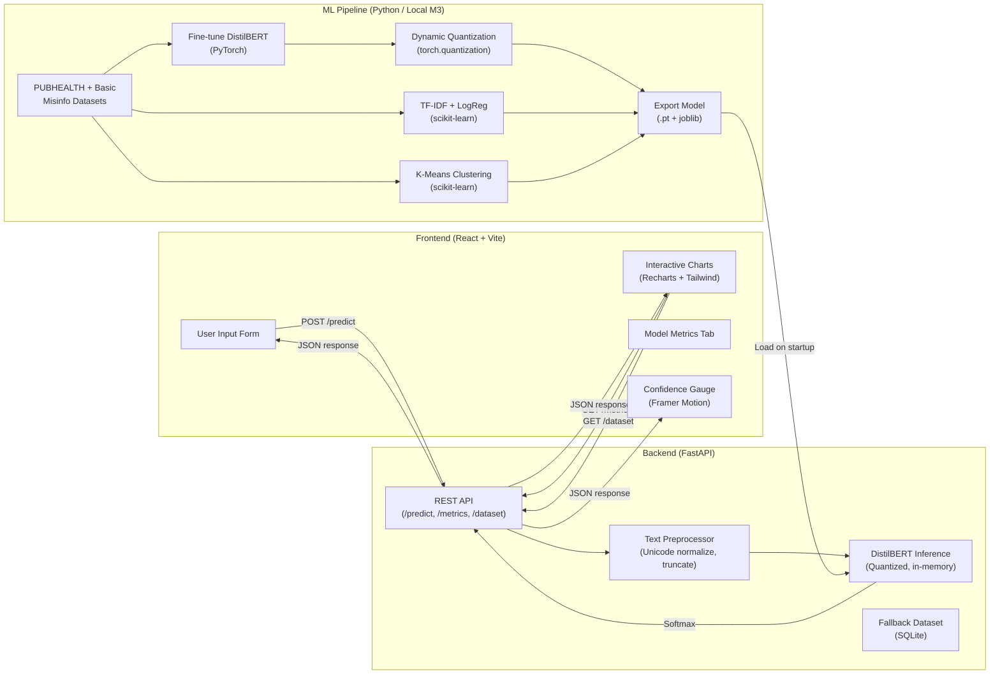

# 🦠 Implementation Plan: Health Misinformation Fact-Checking Dashboard

## Goal Description

Build an **Automated Health Misinformation Fact-Checking Dashboard** that uses a fine-tuned Transformer model (DistilBERT) on the PUBHEALTH dataset to classify health claims as **True, False, Unproven, or Mixture** with confidence scores. The project spans three university assignments (COS30048/COS30049) worth 100% of the unit grade, targeting a **High Distinction (HD)** across all three.

### Outcome
A full-stack web application (React + FastAPI) where users input health claims and receive nuanced, context-aware misinformation classifications — proving the Transformer's attention mechanism understands semantics, not just keywords.

### Constraints
- Must use **React.js** (frontend) and **FastAPI** (backend) per assignment spec
- Must use **at least 2 ML method types** for Assignment 2 (+ extras for HD)
- Must use **additional datasets** beyond the basic provided one for HD
- Must include **≥3 chart types with interactive features** for Assignment 3 HD
- Must include **≥2 HTTP methods** and **≥3 advanced functionalities**
- Model must run within **free-tier cloud RAM** (~512MB–1GB)
- No generative AI for content generation (but allowed for learning/debugging)
- Video demo ≤7 minutes showing all features on desktop, tablet, mobile

### Non-Goals
- No real-time Twitter/X scraping in production (too brittle for grading demo)
- No microservice architecture (monolith is sufficient and more reliable)
- No user authentication system (not required by spec)
- No mobile native app

### Acceptance Criteria
1. Model achieves **Macro F1 ≥ 0.75** on PUBHEALTH test set
2. Dashboard correctly differentiates misinformation from factual text using similar vocabulary (the "Control Test")
3. All 3 assignment rubric criteria are satisfied at HD level
4. Application runs locally with a single `npm run dev` + `uvicorn` command
5. Quantized model fits in **< 200MB** RAM

---

## User Review Required

> [!IMPORTANT]
> **Assignment 2 ML Methods**: The rubric requires ≥2 ML method types. This plan proposes:
> 1. **Classification** — DistilBERT Transformer (primary model)
> 2. **Classification** — TF-IDF + Logistic Regression (baseline comparison)
> 3. **Clustering** — K-Means on TF-IDF embeddings (exploratory data analysis)
>
> Using two classification methods is allowed with "strong justification" (baseline vs. Transformer comparison is strong). The clustering method adds a different type for safety. **Does this combination work for your team?**

> [!NOTE]
> **Dataset Selection**: The plan uses the provided basic dataset (`Constraint-English (Fake)` from the `1misinfo` folder) as the baseline dataset for ML exploration and baseline models. It incorporates `PUBHEALTH` as the mandatory "additional dataset" to train the powerful DistilBERT model, perfectly satisfying the High Distinction rubric requirement.

> [!IMPORTANT]
> **Assignment 1 is a document, not code.** This plan focuses on Assignments 2 and 3 (the code deliverables). Assignment 1's project management plan, WBS, Gantt chart, and UI prototypes should be handled separately. Since the team size is 1, project management overhead is minimal, but the documentation is still required.

---

## Environment & Logistics Decisions (Resolved)
- **Team Size**: Solo developer (1 person). 
- **Deployment Target**: Local demo running on MacBook Air M3.
- **Model Training**: Locally on MacBook Air M3 16GB (using PyTorch MPS). Google Colab is a backup only if disk space becomes an issue.
- **Basic Dataset**: `Constraint-English (Fake)` (.xlsx files) extracted and ready to use.

---

## System Architecture



---

## Proposed Changes

### Phase 1: Project Setup & Data Pipeline
**Effort**: ~3 hours | **Assignment**: 2

> Sets up the monorepo, downloads datasets, and builds the preprocessing pipeline.

---

#### [NEW] `/backend/` — FastAPI Project Skeleton

```
backend/
├── app/
│   ├── __init__.py
│   ├── main.py              # FastAPI app, CORS, lifespan (model loading)
│   ├── routes/
│   │   ├── __init__.py
│   │   ├── predict.py        # POST /predict
│   │   ├── metrics.py        # GET /metrics
│   │   └── dataset.py        # GET /dataset/samples, GET /dataset/stats
│   ├── models/
│   │   ├── __init__.py
│   │   └── schemas.py        # Pydantic request/response models
│   ├── services/
│   │   ├── __init__.py
│   │   ├── preprocessor.py   # Text cleaning, Unicode normalization, truncation
│   │   ├── inference.py      # Model loading + prediction logic
│   │   └── fallback.py       # SQLite fallback dataset queries
│   └── config.py             # Settings (model path, max tokens, etc.)
├── data/
│   ├── pubhealth/            # Additional dataset (PUBHEALTH TSV files for HD)
│   ├── basic_1misinfo/       # Basic dataset (Constraint-English Fake .xlsx files)
│   └── fallback.db           # Pre-analyzed tweets for demo fallback
├── models/                   # Exported model artifacts
│   ├── distilbert_quantized.pt
│   ├── tfidf_logreg.joblib
│   └── kmeans_clusters.joblib
├── notebooks/
│   ├── 01_data_exploration.ipynb
│   ├── 02_preprocessing.ipynb
│   ├── 03_baseline_tfidf.ipynb
│   ├── 04_distilbert_finetune.ipynb
│   ├── 05_quantization.ipynb
│   └── 06_clustering.ipynb
├── requirements.txt
└── README.md
```

#### [NEW] `/frontend/` — React + Vite Project Skeleton

```
frontend/
├── public/
├── src/
│   ├── components/
│   │   ├── Layout/
│   │   │   ├── Header.jsx
│   │   │   ├── Sidebar.jsx
│   │   │   └── Footer.jsx
│   │   ├── Predict/
│   │   │   ├── InputForm.jsx          # Text input + validation
│   │   │   ├── ResultCard.jsx         # Red/Yellow/Green classification card
│   │   │   └── ConfidenceGauge.jsx    # Animated SVG gauge (Framer Motion)
│   │   ├── Charts/
│   │   │   ├── CategoryBarChart.jsx   # Bar chart: claim categories
│   │   │   ├── MetricsRadarChart.jsx  # Radar: Accuracy/Precision/Recall/F1
│   │   │   ├── ConfusionMatrix.jsx    # Tailwind CSS Grid heatmap
│   │   │   ├── TrendAreaChart.jsx     # Area chart with Brush zoom
│   │   │   └── ConfidencePieChart.jsx # Donut chart: confidence distribution
│   │   └── common/
│   │       ├── ErrorBoundary.jsx
│   │       ├── LoadingSpinner.jsx
│   │       └── StatusBadge.jsx        # 🟢 Live / 🟡 Demo Mode
│   ├── hooks/
│   │   ├── usePredict.js              # API call hook for /predict
│   │   └── useMetrics.js              # API call hook for /metrics
│   ├── pages/
│   │   ├── Dashboard.jsx              # Main prediction page
│   │   ├── Analytics.jsx              # Charts + metrics page
│   │   └── About.jsx                  # Project description
│   ├── services/
│   │   └── api.js                     # Axios instance + error interceptors
│   ├── App.jsx
│   ├── main.jsx
│   └── index.css                      # Tailwind directives
├── tailwind.config.js
├── vite.config.js
├── package.json
└── README.md
```

#### [NEW] `backend/app/services/preprocessor.py`

Key preprocessing logic to handle edge cases from the scenario report:

```python
import re
import unicodedata

def preprocess_claim(text: str, max_length: int = 512) -> str:
    """
    Clean and normalize health claim text for model inference.
    Handles: emojis, leetspeak, Unicode homoglyphs, token truncation.
    """
    # Strip emojis and special Unicode symbols
    text = remove_emojis(text)
    
    # Normalize Unicode homoglyphs (e.g., Cyrillic 'а' → Latin 'a')
    text = unicodedata.normalize('NFKD', text)
    
    # Normalize leetspeak patterns (v@cc1ne → vaccine)
    text = normalize_leetspeak(text)
    
    # Collapse whitespace
    text = re.sub(r'\s+', ' ', text).strip()
    
    # Truncate to approximate token limit (words, not chars)
    words = text.split()
    if len(words) > max_length:
        text = ' '.join(words[:max_length])
    
    return text

def remove_emojis(text: str) -> str:
    emoji_pattern = re.compile(
        "[\U0001F600-\U0001F64F\U0001F300-\U0001F5FF"
        "\U0001F680-\U0001F6FF\U0001F1E0-\U0001F1FF"
        "\U00002702-\U000027B0\U000024C2-\U0001F251]+",
        flags=re.UNICODE
    )
    return emoji_pattern.sub('', text)

LEETSPEAK_MAP = {
    '@': 'a', '0': 'o', '1': 'i', '3': 'e',
    '4': 'a', '5': 's', '7': 't', '$': 's',
}

def normalize_leetspeak(text: str) -> str:
    """Best-effort leetspeak normalization for common evasion patterns."""
    result = []
    for char in text:
        result.append(LEETSPEAK_MAP.get(char, char))
    return ''.join(result)
```

---

### Phase 2: Machine Learning Pipeline (Assignment 2 Core)
**Effort**: ~8 hours | **Assignment**: 2

> Train 3 ML models: baseline TF-IDF + Logistic Regression, fine-tuned DistilBERT, and K-Means clustering for EDA.

---

#### [NEW] `backend/notebooks/03_baseline_tfidf.ipynb` — Baseline Model

**Purpose**: Establish a performance baseline and satisfy the "2 ML methods" requirement.

```python
# Key steps:
# 1. Load PUBHEALTH train.tsv
# 2. TF-IDF vectorization (max_features=10000, ngram_range=(1,2))
# 3. Train LogisticRegression(class_weight='balanced', max_iter=1000)
# 4. Evaluate: classification_report, confusion_matrix, macro F1
# 5. Export: joblib.dump(pipeline, 'models/tfidf_logreg.joblib')
```

**Why this matters for HD**: Proves to graders you understand the limitations of bag-of-words approaches. When the "Control Test" fails on TF-IDF but succeeds on DistilBERT, you've demonstrated *why* Transformers are superior.

#### [NEW] `backend/notebooks/04_distilbert_finetune.ipynb` — Primary Model

**Purpose**: Fine-tune DistilBERT on PUBHEALTH for 4-class health claim classification.

```python
# Key training configuration:
from transformers import DistilBertForSequenceClassification, DistilBertTokenizer
from torch.utils.data import DataLoader
import torch

MODEL_NAME = "distilbert-base-uncased"
NUM_LABELS = 4  # true, false, mixture, unproven
LEARNING_RATE = 2e-5
EPOCHS = 3
BATCH_SIZE = 16
MAX_LENGTH = 256  # Token limit (DistilBERT max is 512)

# Weighted Cross-Entropy Loss to handle class imbalance
class_counts = [...]  # From dataset analysis
weights = 1.0 / torch.tensor(class_counts, dtype=torch.float)
weights = weights / weights.sum() * NUM_LABELS
criterion = torch.nn.CrossEntropyLoss(weight=weights.to(device))
```

**Training environment**: Google Colab (free T4 GPU). Training ~19k samples × 3 epochs ≈ 15–30 minutes.

#### [NEW] `backend/notebooks/05_quantization.ipynb` — Model Optimization

```python
import torch

# Load fine-tuned model
model = DistilBertForSequenceClassification.from_pretrained('./fine_tuned_model/')
model.eval()

# Apply dynamic quantization (Linear layers → INT8)
quantized_model = torch.quantization.quantize_dynamic(
    model,
    {torch.nn.Linear},
    dtype=torch.qint8
)

# Save quantized model
torch.save(quantized_model.state_dict(), 'models/distilbert_quantized.pt')

# Size comparison:
# Original:  ~250MB
# Quantized: ~65MB  (74% reduction)
```

#### [NEW] `backend/notebooks/06_clustering.ipynb` — EDA Clustering

**Purpose**: Satisfy the "different ML method type" requirement (clustering ≠ classification). Provides visual insight into claim topic distribution.

```python
# Key steps:
# 1. TF-IDF vectorize all claims
# 2. Reduce dimensionality with PCA (n_components=50)
# 3. K-Means clustering (k=5, corresponding to health topic clusters)
# 4. Visualize clusters with t-SNE (2D plot)
# 5. Analyze: what topics cluster together? (vaccines, nutrition, cancer, etc.)
# 6. Export: joblib.dump(kmeans, 'models/kmeans_clusters.joblib')
```

**Why this matters for HD**: Shows graders you explored the data structure, not just trained a classifier. The t-SNE plot becomes a beautiful chart in the dashboard.

---

### Phase 3: FastAPI Backend (Assignment 3 Core)
**Effort**: ~5 hours | **Assignment**: 3

> Build the REST API with model integration, error handling, and input validation.

---

#### [NEW] `backend/app/main.py`

```python
from fastapi import FastAPI
from fastapi.middleware.cors import CORSMiddleware
from contextlib import asynccontextmanager
from app.services.inference import load_models
from app.routes import predict, metrics, dataset

@asynccontextmanager
async def lifespan(app: FastAPI):
    """Load ML models into memory on startup."""
    app.state.models = load_models()
    yield
    # Cleanup on shutdown

app = FastAPI(
    title="Health Misinformation Detector API",
    version="1.0.0",
    lifespan=lifespan
)

app.add_middleware(
    CORSMiddleware,
    allow_origins=["http://localhost:5173"],  # Vite dev server
    allow_methods=["*"],
    allow_headers=["*"],
)

app.include_router(predict.router, prefix="/api")
app.include_router(metrics.router, prefix="/api")
app.include_router(dataset.router, prefix="/api")
```

#### [NEW] `backend/app/routes/predict.py` — Core Prediction Endpoint

```python
from fastapi import APIRouter, HTTPException, Request
from app.models.schemas import PredictRequest, PredictResponse
from app.services.preprocessor import preprocess_claim
from app.services.inference import predict_claim

router = APIRouter()

@router.post("/predict", response_model=PredictResponse)
async def predict(request: Request, body: PredictRequest):
    """
    Classify a health claim as True, False, Mixture, or Unproven.
    Returns label + confidence scores for all 4 classes.
    """
    if not body.text or not body.text.strip():
        raise HTTPException(status_code=400, detail="Text input cannot be empty.")
    
    if len(body.text) > 5000:
        raise HTTPException(status_code=400, detail="Text exceeds 5000 character limit.")
    
    cleaned = preprocess_claim(body.text)
    models = request.app.state.models
    
    result = predict_claim(cleaned, models["distilbert"], models["tokenizer"])
    
    return PredictResponse(
        label=result["label"],           # e.g., "false"
        confidence=result["confidence"],  # e.g., 0.94
        scores=result["scores"],          # {"true": 0.02, "false": 0.94, ...}
        preprocessed_text=cleaned,
    )
```

#### API Endpoints Summary (≥2 HTTP Methods: POST + GET)

| Method | Endpoint | Purpose |
|--------|----------|---------|
| `POST` | `/api/predict` | Classify a health claim |
| `GET` | `/api/metrics` | Return model evaluation metrics (F1, precision, recall, confusion matrix) |
| `GET` | `/api/dataset/stats` | Return dataset statistics (class distribution, sample counts) |
| `GET` | `/api/dataset/samples` | Return sample claims from each class (paginated) |
| `DELETE` | `/api/predict/history` | Clear prediction history (advanced functionality) |

---

### Phase 4: React Frontend Dashboard (Assignment 3 Core)
**Effort**: ~8 hours | **Assignment**: 3

> Build the interactive dashboard with ≥3 chart types, input validation, and responsive design.

---

#### Chart Implementation Strategy (5 Charts for HD)

| # | Chart Type | Library | Interactive Feature | Rubric Target |
|---|-----------|---------|---------------------|---------------|
| 1 | **Bar Chart** — Class distribution | Recharts `<BarChart>` | Legend click filtering + custom JSX tooltips | Chart Diversity |
| 2 | **Radar Chart** — Model metrics comparison | Recharts `<RadarChart>` | Hover tooltips with metric explanations | Chart Diversity |
| 3 | **Area Chart** — Prediction history trend | Recharts `<AreaChart>` + `<Brush>` | **Time-window zoom** via Brush component | Interactivity |
| 4 | **Confusion Matrix** — Model evaluation | Custom Tailwind CSS Grid | Cell hover tooltips showing TP/FP/TN/FN rates | Interactivity |
| 5 | **Donut Chart** — Confidence distribution | Recharts `<PieChart>` | Active sector animation on click | Chart Diversity |

#### [NEW] `frontend/src/components/Predict/InputForm.jsx`

```jsx
// Key validation logic:
// - Required field check (cannot be empty)
// - Max 5000 characters with live counter
// - Debounced submission (prevent double-click)
// - Loading state with spinner during API call
// - Error display for API failures (toast notification)
```

#### [NEW] `frontend/src/components/Predict/ResultCard.jsx`

```jsx
// Dynamic color card based on prediction:
// - "true"     → Green bg, ✅ icon, "Factual / Scientific Consensus"
// - "false"    → Red bg, ❌ icon, "Health Misinformation"
// - "mixture"  → Yellow bg, ⚠️ icon, "Mixed / Partially True"
// - "unproven" → Blue bg, ❓ icon, "Unproven / Insufficient Evidence"
//
// Shows: Label, Confidence %, all 4 class scores as mini bar chart
// Animated entrance via Framer Motion
```

#### [NEW] `frontend/src/components/Charts/ConfusionMatrix.jsx`

```jsx
// Custom Tailwind CSS Grid (4×4) — zero extra dependencies
// - Dynamic cell opacity based on count/total
// - Color: bg-emerald-500 for correct, bg-rose-500 for incorrect
// - Hover tooltip shows: count, percentage, metric name
// - Row/column labels: True, False, Mixture, Unproven
```

#### Advanced Functionalities for HD (≥3 Required)

1. **Export Predictions** — Download prediction history as CSV
2. **Compare Models** — Toggle between DistilBERT and TF-IDF baseline predictions side-by-side
3. **Batch Analysis** — Upload a text file with multiple claims, get bulk classification results
4. **Dark Mode** — Tailwind `dark:` variant toggle
5. **Responsive Design** — Tailwind breakpoints for desktop/tablet/mobile

---

### Phase 5: Integration, Testing & Polish
**Effort**: ~4 hours | **Assignment**: 3

---

#### Error Handling Strategy (3 pts in rubric)

| Layer | Error | Handling |
|-------|-------|----------|
| Frontend | Empty input | Inline validation message, disabled submit button |
| Frontend | API timeout | Toast: "Server is taking too long. Please try again." + retry button |
| Frontend | Network error | Toast: "Cannot reach server. Check your connection." |
| Backend | Empty text body | HTTP 400: `{"detail": "Text input cannot be empty."}` |
| Backend | Text too long | HTTP 400: `{"detail": "Text exceeds 5000 character limit."}` |
| Backend | Model inference error | HTTP 500: `{"detail": "Model inference failed."}` + logged |
| Backend | Invalid endpoint | HTTP 404: auto-handled by FastAPI |

#### Responsive Breakpoints (Required for Video Demo)

```css
/* Tailwind breakpoints to demonstrate in video */
sm:  640px   /* Mobile landscape */
md:  768px   /* Tablet */
lg:  1024px  /* Desktop */
xl:  1280px  /* Wide desktop */
```

---

## Verification Plan

### Automated Tests

```bash
# Backend unit tests (pytest)
cd backend && python -m pytest tests/ -v

# Key test cases:
# - test_predict_empty_input → expects 400
# - test_predict_valid_claim → expects 200 + valid label
# - test_predict_long_text → expects 400
# - test_metrics_endpoint → expects 200 + valid metrics JSON
# - test_preprocessor_emoji_removal → "Big Pharma 🤡" → "Big Pharma"
# - test_preprocessor_leetspeak → "v@cc1ne" → "vaccine"

# Frontend (optional, not graded)
cd frontend && npm run build  # Verify production build succeeds
```

### Manual Verification

#### The "Control Test" (Critical Demo Moment)

1. **Misinformation Input**: *"Big Pharma doesn't want you to know that replacing your water with alkaline water infused with Himalayan salt cures chronic inflammation in 48 hours."*
   - **Expected**: Red card → "Health Misinformation" → Confidence ≥ 85%

2. **Factual Input** (same buzzwords): *"Research indicates that chronic inflammation can be managed with a balanced diet, but claims that alkaline water cures it rapidly are currently unproven by clinical trials."*
   - **Expected**: Green/Blue card → "Factual" or "Unproven" → Confidence ≥ 80%

3. **Edge Case — Leetspeak**: *"v@cc1nes caus3 aut1sm, d0 your r3search"*
   - **Expected**: Red card → "Health Misinformation" after preprocessing normalization

#### Responsive Check
- [ ] Open dashboard at 1280px (desktop) — all charts side-by-side
- [ ] Resize to 768px (tablet) — charts stack vertically
- [ ] Resize to 375px (mobile) — single column, input form fills width

#### Video Demo Checklist (≤7 minutes)
- [ ] Show full application startup (both frontend and backend)
- [ ] Demonstrate text input with validation (empty, too long)
- [ ] Run the "Control Test" (misinformation vs. factual)
- [ ] Show all 5 chart types with interactive features
- [ ] Demonstrate model comparison (DistilBERT vs. TF-IDF)
- [ ] Show batch analysis feature
- [ ] Show CSV export
- [ ] Demonstrate responsive design (desktop → tablet → mobile)
- [ ] Explain key technical decisions (why DistilBERT, why quantization)

---

## Phase Summary

| Phase | Description | Effort | Assignment |
|-------|------------|--------|------------|
| 1 | Project Setup & Data Pipeline | ~3h | A2 |
| 2 | ML Pipeline (3 models + quantization) | ~8h | A2 |
| 3 | FastAPI Backend | ~5h | A3 |
| 4 | React Frontend Dashboard | ~8h | A3 |
| 5 | Integration, Testing & Polish | ~4h | A3 |
| **Total** | | **~28h** | |

---

## Risk Assessment

| Risk | Severity | Mitigation | Signal it Broke | Response |
|------|----------|------------|-----------------|----------|
| PUBHEALTH dataset unavailable or corrupted | High | Mirror dataset in project repo; use COVID Fake News as fallback | Download fails or TSV parse errors | Switch to COVID-19 dataset as primary |
| DistilBERT F1 < 0.70 on PUBHEALTH | High | Increase epochs (3→5), adjust learning rate, try DistilRoBERTa | Validation F1 plateaus below target | Switch to `distilroberta-base`; add data augmentation |
| Quantized model accuracy drops significantly | Medium | Test quantized vs. original on test set; accept ≤2% drop | Accuracy delta > 3% after quantization | Use half-precision (FP16) instead of INT8 |
| Colab GPU not available for training | Medium | Use Kaggle notebooks (free P100 GPU) as alternative | Colab shows "GPU unavailable" | Switch to Kaggle; training code is portable |
| React chart library version conflicts | Low | Pin exact versions in package.json | `npm install` fails | Lock to Recharts 2.x; avoid canary versions |

---

## HD Scoring Matrix

This maps every rubric criterion to the specific feature that addresses it:

### Assignment 2 (40 pts)
| Criterion | Points | How This Plan Addresses It |
|-----------|--------|---------------------------|
| Data Collection & Processing | 5 | PUBHEALTH + COVID dataset; detailed preprocessing notebook |
| Data Analysis | 2 | EDA notebook with t-SNE visualization, class distribution |
| Model Selection Justification | 2 | Report compares TF-IDF baseline vs. DistilBERT with the "Control Test" |
| Core Functionalities | 10 | 3 ML methods: LogReg, DistilBERT, K-Means; weighted loss; macro F1 |
| Additional Datasets | 4 | PUBHEALTH + Constraint-English (Fake) Basic Dataset |
| Additional ML Implementations | 4 | K-Means clustering + DistilBERT (beyond basic 2) |

### Assignment 3 (45 pts)
| Criterion | Points | How This Plan Addresses It |
|-----------|--------|---------------------------|
| AI Model Integration | 3 | Quantized DistilBERT loaded in FastAPI lifespan; real-time inference |
| Frontend-Backend Communication | 4 | Axios with error interceptors; POST + GET endpoints |
| Error Handling & Validation | 3 | Full error table above; frontend + backend validation |
| Backend API Design | 4 | 5 RESTful endpoints; POST + GET + DELETE; documented |
| Real-time Updates | 4 | Animated confidence gauge; live result cards; Framer Motion |
| Chart Diversity | 3 | 5 chart types: Bar, Radar, Area, Confusion Matrix, Donut |
| Chart Interactivity | 4 | Brush zoom, legend filtering, cell hover tooltips |
| Data Representation Clarity | 2 | Labeled axes, legends, titles, color coding |
| UI Design | 3 | Tailwind CSS; responsive; dark mode; polished components |
| UX Design | 3 | CSV export; batch analysis; model comparison; smooth transitions |
