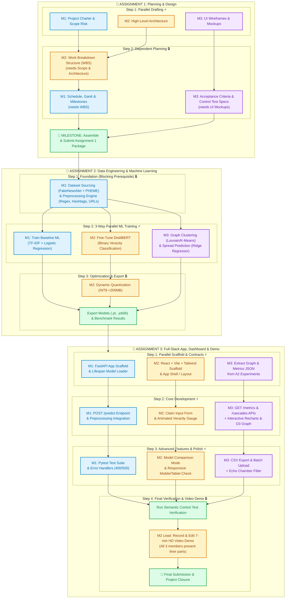

# 👥 3-Member Team Workload Allocation & Dependency Plan
**Project:** Automated Political & Breaking News Misinformation Detection Dashboard  
**Unit:** COS30048 / COS30049  
**Team Size:** 3 Members  

---

## 🎯 Guiding Strategy: Cross-Functional Slices
Rather than siloing members into single technical layers (e.g., one person doing only frontend), **each member contributes to Documentation, Machine Learning, and Application Development** across all 3 assignments.

- **Member 1:** Integration & Backend Lead *(Scope, Baseline ML, Core API, Backend Tests)*
- **Member 2:** Model & Frontend Core Lead *(Architecture, DistilBERT Transformer, Core UI, Demo Lead)*
- **Member 3:** Analytics, Graph & Visualization Lead *(UI Mockups, Advanced ML, Charts & Advanced Features)*

---

## 📋 Member Breakdown Across All 3 Assignments

```
┌────────────────────────────────────────────────────────────────────────────────────────┐
│                               MEMBER 1: Integration Lead                               │
├───────────────────┬──────────────────────────────────┬─────────────────────────────────┤
│   Assignment 1    │           Assignment 2           │          Assignment 3           │
│ Project Charter   │ Dataset Ingestion & Cleaning     │ FastAPI Skeleton & Lifespan     │
│ Scope & Risks     │ Political Text Preprocessor      │ POST /predict Core Endpoint     │
│ Project Schedule  │ Baseline ML (TF-IDF + LogReg)    │ Pytest Suite & Error Validation │
└───────────────────┴──────────────────────────────────┴─────────────────────────────────┘

┌────────────────────────────────────────────────────────────────────────────────────────┐
│                               MEMBER 2: Core Tech Lead                                 │
├───────────────────┬──────────────────────────────────┬─────────────────────────────────┤
│   Assignment 1    │           Assignment 2           │          Assignment 3           │
│ Architecture Doc  │ Primary ML (DistilBERT Training) │ React + Vite + Tailwind Scaffold│
│ WBS Breakdown     │ INT8 Dynamic Quantization        │ Prediction UI & Animated Gauge  │
│ Roles & Standards │ Model Export & Size Benchmark    │ Video Demo Lead & Coordination  │
└───────────────────┴──────────────────────────────────┴─────────────────────────────────┘

┌────────────────────────────────────────────────────────────────────────────────────────┐
│                          MEMBER 3: Analytics & Insights Lead                           │
├───────────────────┬──────────────────────────────────┬─────────────────────────────────┤
│   Assignment 1    │           Assignment 2           │          Assignment 3           │
│ UI/UX Mockups     │ Graph Community Detection        │ 5x Interactive Recharts & D3 Graph
│ Acceptance Specs  │ Cascade Spread Regressor (Ridge) │ Advanced Features (CSV, Batch)  │
│ Control Test Plan │ Feature Importance & Clustering  │ GET /metrics & /cascades Routes │
└───────────────────┴──────────────────────────────────┴─────────────────────────────────┘
```

---

## 🔄 Visual Dependency & Parallel Execution Flow

This chart shows **what can be done simultaneously in parallel (⚡)** and **what must wait for prerequisites (🔒)**.



---

## 📅 Chronological Execution Schedule

| Timeline Phase | Member 1 (Integration) | Member 2 (Core Tech) | Member 3 (Analytics) | Execution Mode |
|---|---|---|---|---|
| **A1: Days 1–3** | Draft Project Charter & Scope Risk Register | Draft System Architecture & Technology Stack | Design UI Wireframes & Dashboard Layouts | **Parallel ⚡** |
| **A1: Days 4–6** | Draft Timeline, Gantt Chart & Milestones | Build Work Breakdown Structure (WBS) | Write Acceptance Criteria & Control Test Specs | **Coordinated 🔄** |
| **A1: Day 7** | *All Members Review, Format, and Submit Assignment 1 Package* | | | **Milestone 🎯** |
| **A2: Days 8–10** | Source FakeNewsNet + PHEME & Write Preprocessor | *Prepare training environment (PyTorch MPS/CUDA)* | *Analyze social graph schema & feature set* | **Prerequisite 🔒** *(M1 leads)* |
| **A2: Days 11–15** | Train TF-IDF + Logistic Regression Baseline | Fine-Tune DistilBERT Transformer | Perform Graph Community Detection & Ridge Regression | **Parallel ⚡** *(All 3 train models)* |
| **A2: Days 16–18** | Benchmark Baseline metrics (F1, confusion matrix) | Perform INT8 Dynamic Quantization (<200MB) | Extract feature importance & community cluster data | **Parallel ⚡** |
| **A2: Day 19** | *All Members Consolidate Notebooks, Model Artifacts & ML Report* | | | **Milestone 🎯** |
| **A3: Days 20–22** | Scaffold FastAPI app & Lifespan model loader | Scaffold React+Vite+Tailwind & Main Layout | Format graph/metrics JSON data for API responses | **Parallel ⚡** |
| **A3: Days 23–26** | Build & test `POST /predict` endpoint | Build Input Form, Veracity Card & Gauge | Build `GET /metrics` routes & Interactive Charts | **Parallel ⚡** |
| **A3: Days 27–29** | Write Pytest suite & input validation | Implement Model Comparison & Responsive UI | Implement CSV Export & Batch Claim Upload | **Parallel ⚡** |
| **A3: Day 30** | Run Semantic Control Tests & API benchmarks | Coordinate & Record 7-min Video Demo | Verify chart tooltips & visual clarity | **Final Sprint 🚀** |

---

## 💡 Why This Distribution Maximizes Grades & Minimizes Risk

1. **No Single Point of Failure:** Because all three members understand the machine learning pipeline and the full-stack architecture, if one person gets sick or busy, another can easily support them.
2. **Balanced Grading Rubric Alignment:**
   - **A1:** Balanced between project planning, architectural design, and UI specs.
   - **A2:** Satisfies all requirements for primary model (DistilBERT), baseline model (TF-IDF), clustering (Louvain), and regression (Ridge).
   - **A3:** Satisfies frontend, backend, chart diversity (≥5 charts), error handling, and video presentation criteria.
3. **Clear Interface Contracts:** Once M1 finishes the preprocessing script in A2, all 3 can train models independently. Once M1 defines the API schemas in A3, frontend and backend development happen concurrently without blocking.
